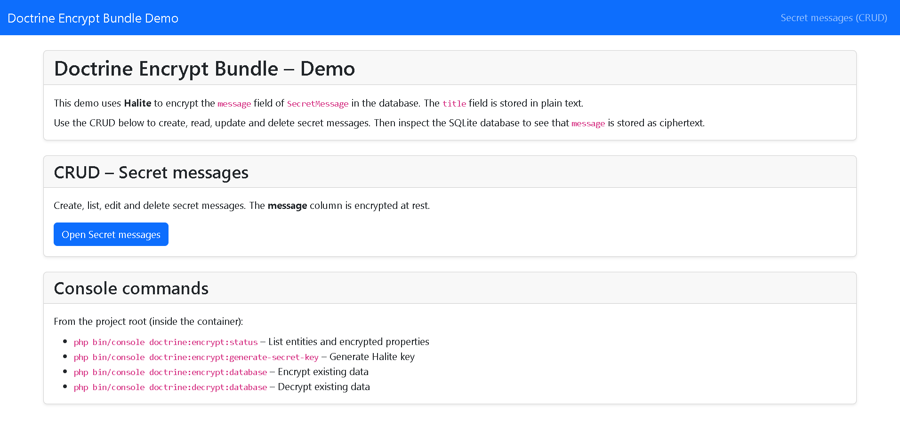
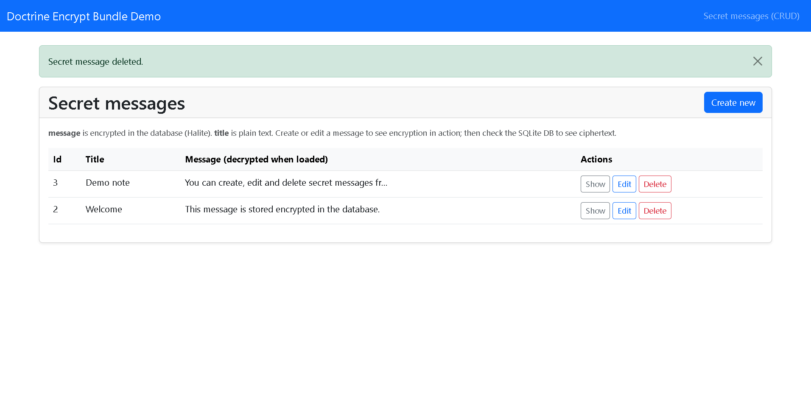

# Demo Projects

The bundle includes two **dockerized** demo projects (Symfony 7 and 8). Each runs on **FrankenPHP** with a custom **Caddyfile** and has its own **Makefile**.

## Screenshots

**Demo home** – Overview, CRUD link and console commands:



**Secret messages (CRUD)** – List of messages (encrypted in DB with Halite), create/edit/delete:



| Demo      | Path            | Default port | PHP |
|-----------|-----------------|--------------|-----|
| Symfony 7 | `demo/symfony7/` | 8007         | 8.2 |
| Symfony 8 | `demo/symfony8/` | 8008         | 8.4 |

## Quick start (Docker)

From the **demo directory** (e.g. `demo/symfony8`):

```bash
make up        # Start FrankenPHP container
make install   # composer install (bundle from /var/doctrine-encrypt-bundle)
make setup     # install + DB create + schema + generate secret key
```

Then open **http://localhost:8008** (or the port shown by `make up`).

## Makefile targets

- **up** – Start containers (FrankenPHP HTTP on configured port).
- **down** – Stop containers.
- **build** – Rebuild image (no cache).
- **install** – `composer install` in container.
- **setup** – install + db create + schema update + secret key + fixtures.
- **shell** – Shell in PHP container.
- **logs** – Container logs.
- **db-create**, **db-schema**, **key**, **fixtures** – Database, encryption key, and sample data.
- **cache-clear**, **update-bundle**, **test** – Cache, bundle update, tests.

Change port: `PORT=9008 make up`.

## What each demo includes

- **Dockerfile** – FrankenPHP (Alpine), extensions: zip, intl, sodium, pdo_sqlite; custom Caddyfile.
- **docker/frankenphp/Caddyfile** – Root `/app/public`, worker `index.php`, encoding (zstd, br, gzip).
- **docker-compose.yml** – Service `php`, volumes: demo dir + bundle root as `/var/doctrine-encrypt-bundle`.
- **Makefile** – Targets above.
- **public/index.php** – Symfony front controller.
- **config/** – Bundles (DoctrineEncryptBundle), Doctrine, `nowo_doctrine_encrypt.yaml`.
- **src/Entity/SecretMessage.php** – Example entity with `#[Encrypted]` property.
- **src/Entity/SensitiveRecord.php** – Entity with two configs: `personal_data` and `financial_data`.
- **src/Controller/DemoController.php** – Home route.
- **src/Controller/EncryptUtilDemoController.php** – Page that uses **EncryptUtil**, **MaskUtil**, and the Twig filters **`|decrypt`** and **`|mask`**.
- **Templates** – CRUD for Secret messages and Sensitive records, plus the EncryptUtil & Twig demo page.

The bundle is installed via Composer **path repository** pointing to `/var/doctrine-encrypt-bundle` (mounted from the repo root). See **demo/README.md** for more detail.

## Multiple encryptors and EncryptUtil (both demos)

**Symfony 7** and **Symfony 8** demos both use **multiple encryptor configs**. In `config/packages/nowo_doctrine_encrypt.yaml` you’ll find:

- **configs:** e.g. `personal_data` (Halite), `financial_data` (Defuse), and optionally `env_var` (key from `%env(APP_ENCRYPT_KEY)%`), each with its own key or key file.
- **default_config:** `personal_data` (used by `#[Encrypted]` without a config name).

**SecretMessage** uses the default config. **SensitiveRecord** uses both:

- `personal_note` → `#[Encrypted('personal_data')]`
- `financial_note` → `#[Encrypted('financial_data')]`

The **"EncryptUtil & Twig"** page demonstrates programmatic encrypt/decrypt via **EncryptUtil**, masking via **MaskUtil**, and the Twig filters **`|decrypt`** and **`|mask`** (default and config-specific usage). Run `make encrypt-status` (or `php bin/console doctrine:encrypt:status`) in the demo directory to see entities and encrypted properties. Full reference: [Configuration](CONFIGURATION.md#example-multiple-encryptors), [Usage](USAGE.md) (EncryptUtil, MaskUtil, Twig filters).
